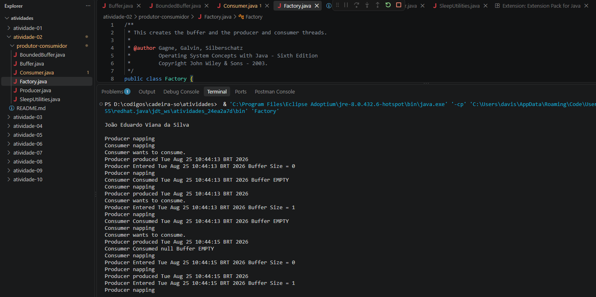

# Atividade 02 - Sistemas Operacionais

Este diretório contém a resolução da **Atividade 02**, que tem como objetivo evidenciar a execução do programa referente ao problema de concorrência **Produtor-Consumidor** implementado em Java.

## 📁 Estrutura do Projeto

Os arquivos do algoritmo estão localizados dentro da subpasta `produtor-consumidor/`. O ponto de entrada do programa é a classe `Factory.java`.

- `Factory.java`: Classe principal que inicia o servidor (buffer) e as threads.
- `Producer.java` / `Consumer.java`: Classes que representam o produtor e o consumidor.
- `Buffer.java` / `BoundedBuffer.java`: Classes que gerenciam o espaço de memória compartilhado.
- `SleepUtilities.java`: Utilitário para simular tempo de processamento.

## 💻 Evidência de Execução

Abaixo está o print da execução do algoritmo, contendo o código e a identificação solicitada pelo professor:

